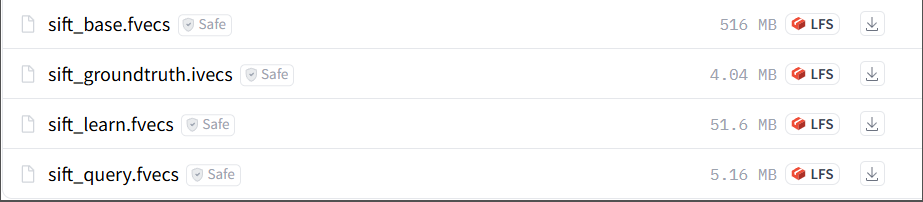
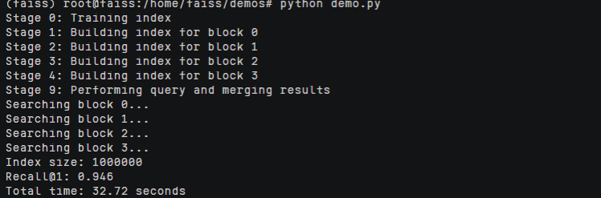

# Faiss部署指南


## ‌一、环境准备

### 更新系统

#### EulerOS2.0

```
yum -y update  
yum -y upgrade
```

#### Ubuntu 24.04

```
apt-get -y update
export DEBIAN_FRONTEND=noninteractive
apt-get -y -o Dpkg::Options::="--force-confold" dist-upgrade
```

## **二、安装conda**

```
mkdir -p ~/miniconda3

wget https://repo.anaconda.com/miniconda/Miniconda3-latest-Linux-aarch64.sh -O ~/miniconda3/miniconda.sh

bash ~/miniconda3/miniconda.sh -b -u -p ~/miniconda3

rm -f ~/miniconda3/miniconda.sh

source ~/miniconda3/bin/activate

conda init --all
```

创建虚拟环境

```
conda create -n faiss python=3.10
```

## **三、源码下载**

### **1.下载faiss的源码**

```
git clone https://github.com/facebookresearch/faiss.git

安装依赖：

pip install faiss-cpu -i https://pypi.tuna.tsinghua.edu.cn/simple

sudo yum update -y

sudo yum install -y openblas-devel

sudo yum install -y swig

sudo yum install -y python3-devel

sudo yum install -y gflags-devel

pip install numpy -i https://pypi.tuna.tsinghua.edu.cn/simple

cmake -B build . -DFAISS_ENABLE_GPU=OFF -DBUILD_SHARED_LIBS=ON

make -C build -j faiss

sudo make -C build install
```

### **2.下载数据集**

https://huggingface.co/datasets/qbo-odp/sift1m/tree/main

 

然后将下载的数据集放到faiss下面的data目录中

## **四、启动项目**

### **1.修改代码**

官方代码使用的是分布式近似最近邻搜索，但是分布式消耗资源大，然后进行修改，修改为单机模式能够完成同样的功能。

修改代码为[demo.py](../scripts/demo.py)


### **2.运行**

```
python demo.py
```

 
